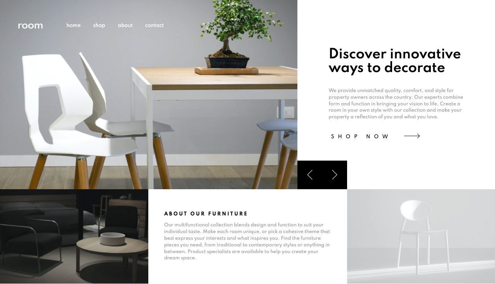

# Frontend Mentor - Room homepage solution

This is a solution to the [Room homepage challenge on Frontend Mentor](https://www.frontendmentor.io/challenges/room-homepage-BtdBY_ENq). Frontend Mentor challenges help you improve your coding skills by building realistic projects.

## Table of contents

- [Overview](#overview)
  - [The challenge](#the-challenge)
  - [Screenshot](#screenshot)
  - [Links](#links)
- [My process](#my-process)
  - [Built with](#built-with)
  - [What I learned](#what-i-learned)
  - [Continued development](#continued-development)
  - [Useful resources](#useful-resources)
- [Author](#author)
- [Acknowledgments](#acknowledgments)

## Overview

### The challenge

Users should be able to:

- View the optimal layout for the site depending on their device's screen size
- See hover states for all interactive elements on the page
- Navigate the slider using either their mouse/trackpad or keyboard

### Screenshot

### Links

- Solution URL: [Repo](https://github.com/vincentbaylon/room-homepage)
- Live Site URL: [Live](https://room-homepage-vb.netlify.app/)

## My process

### Built with

- Semantic HTML5 markup
- Flexbox
- CSS Grid
- BEM
- SASS
- JavaScript

### What I learned

This project tested my basic HTML/CSS/JS skills in a good way. It was very challenging but I learned a lot and I feel it greatly improved my grasp on these languages, especially CSS.

### Continued development

I've fallen in love with CSS/SASS/BEM during this project and will continue to push myself with new projects to improve with these languages.

### Useful resources

- [CSS BEM](http://getbem.com/introduction/) - This helped me learn about BEM methodology.

## Author

- Website - [Profile](https://vincentbaylon.com/)
- Frontend Mentor - [@vincentbaylon](https://www.frontendmentor.io/profile/vincentbaylon)
- LinkedIn - [@vincentbaylon](https://www.linkedin.com/in/vincentbaylon/)
- Twitter - [@vincentbaylon\_](https://www.twitter.com/vincentbaylon_)
